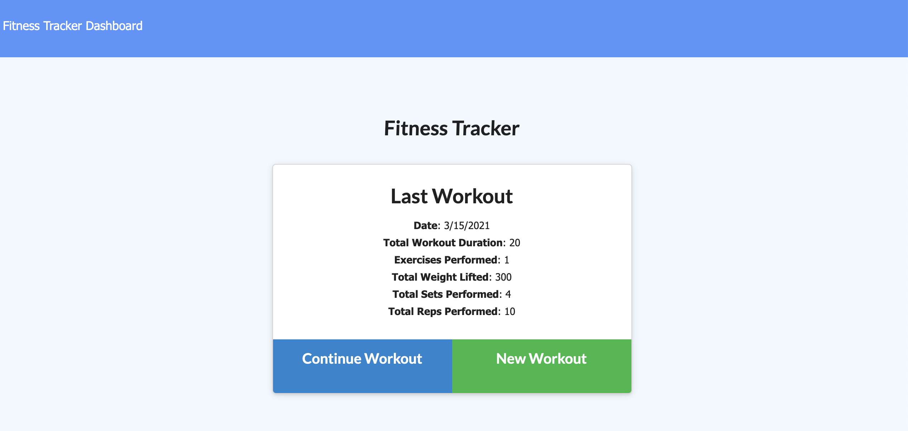
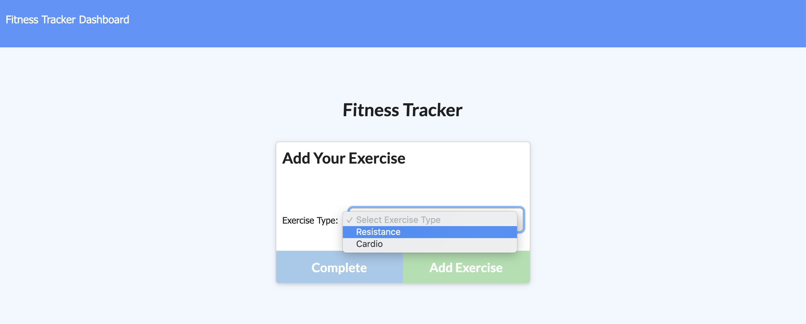
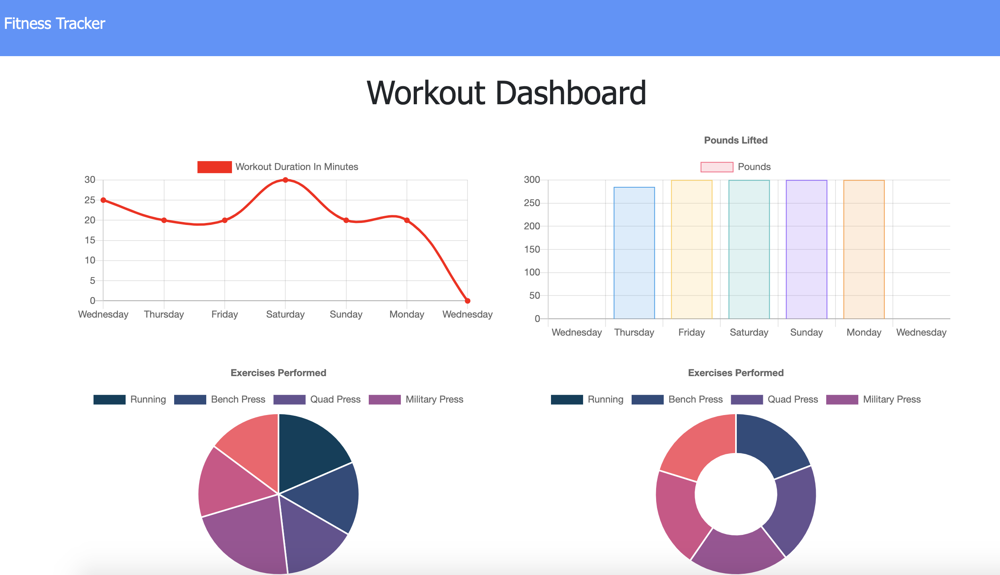

# Unit 17 NoSQL Homework: Workout Tracker

# Fitness Tracker

* As a user, I want to be able to view create and track daily workouts. I want to be able to log multiple exercises in a workout on a given day. I should also be able to track the name, type, weight, sets, reps, and duration of exercise. If the exercise is a cardio exercise, I should be able to track my distance traveled. 

## Table of Contents
* [Screenshots](#Screenshots)
* [Installation](#Installation)
* [Technologies](#Technologies)
* [Repository](#Repository)
* [Deployment](#Deployment)

## Screenshots
* [Landing Page](#public/assets/landingpage.png)
* [Add New Exercise](#public/assets/newworkout.png)
* [Dashboard](#public/assets/dashboard.png)

#### Landing Page
The screenshot of the Workout Tracker landing page.

  

#### Add New Exercise
The screenshot of the Add New Exercise page.

  

#### Dashboard
The screenshot of the Dashboard page.

  

## Installation

* Install node.js to computer follow instructions from  [here](https://nodejs.org/en/)
* Copy all the application files locally to one's machine.
* Install 'mongoose', 'morgan', 'express' npm package by running 

    * **npm install**

* Run the application by the following instructions in the terminal

    * **node server.js**

The application will be listened on localhost:3030 in your browser URL line.

## Technologies

* Mongoose
* Express
* Node.js
* Heroku
* morgan

## Repository

The link to the github repository is: https://github.com/lhaodev/fitness_tracker 

## Deployment

The link to the deployed application is: https://fast-mesa-62687.herokuapp.com/
